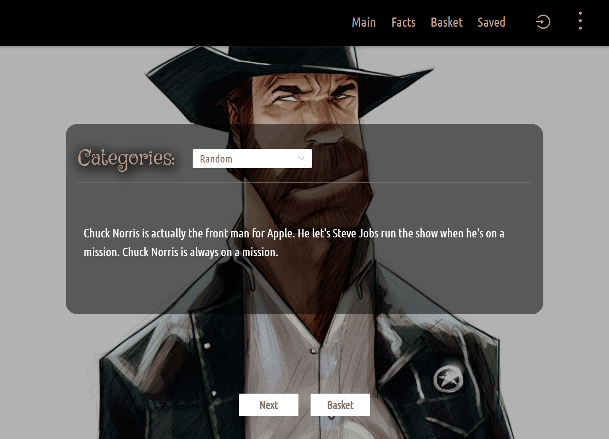

# Joke-Generator

## Project Description

This website contains jokes about Chuck Norris, called Chuck Norris "facts". Within the site, you can find random facts or facts from specific categories, temporarily add them to your joke basket or permanently save them to your saved facts. Facts are taken from chucknorris.io.

Disclaimer: I take no responsibility for sexist jokes. This is just an exercise in learning certain technologies.

#### Used Technologies:

- React
- CSS Module
- Ant Design
- Axios

## How to Install and Run the Project

1. **Clone** the project
2. **Run** npm install
3. **Run** npm start

**Not:** The project run "http://localhost:3000"

## What does the project look like?

- To see the project click [here](https://joke-generator-psi.vercel.app/)

